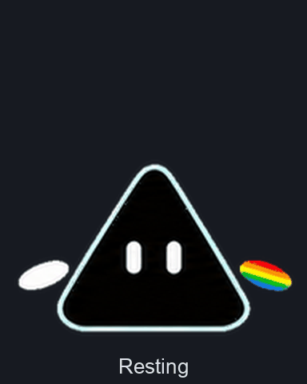

# Prismo

Your friend from the dark side.

**[Play with Prismo - Live demo](https://prismo.audiofool.chatgpt.site)**

Prismo is a small animated companion for **ChatGPT Pets and dots**, with floating white and rainbow hands.
It blinks, waves, glides, thinks, and takes the occasional little leap.

## Get Prismo

**[Adopt Prismo](https://chatgpt.com/s/sharepet_6abe41c226b88191999c142ad5f6f384)**

Open the shared page and sign in to ChatGPT if prompted, then follow the adoption flow available for your account.
Adoption adds an editable copy to your pet library; select Prismo afterward to make it active.

In a ChatGPT Work chat with the **Pets plugin enabled**, you can also ask:

> Adopt Prismo from https://chatgpt.com/s/sharepet_6abe41c226b88191999c142ad5f6f384

### Upload in ChatGPT web

Where Pets are available for your account and workspace:

1. Open the [web-compatible sprite sheet](https://raw.githubusercontent.com/Audiofool934/prismo/main/spritesheet-v1.png) and save it as a PNG.
2. In ChatGPT web, open **Settings > Personalization > Pet > Select pet**, then choose **Upload pet**.
3. Upload the saved PNG and select Prismo.

This transparent v1 PNG is 1536 x 1872 pixels and under 1 MiB, matching the format in the [official Pets guide](https://learn.chatgpt.com/docs/pets).
The web upload setting is separate from the desktop app's **Settings > Pets**.

### Use Prismo as your ChatGPT dot

Prismo can also be used as your **ChatGPT dot's appearance** where custom pet selection is available.
After adding Prismo to your library, choose it from your dot's available appearance options.
Dot availability and customization controls vary by account and app version; see the [official dot guide](https://learn.chatgpt.com/docs/dots).

### Full sprite sheet

For clients and Pets workflows that accept the newer v2 format, use [spritesheet.png](https://raw.githubusercontent.com/Audiofool934/prismo/main/spritesheet.png).
It includes all nine animations plus sixteen look directions.
The web-compatible v1 file contains the same nine animations, with the two look-direction rows omitted.

## Preview

Switch between the nine animations, pause, or select **Follow my pointer** to try the sixteen look directions.
The demo uses a dark backdrop and works on desktop and mobile.
For an offline copy, choose **Code > Download ZIP**, extract it, and open `preview.html` in a browser.

An identical [GitHub Pages mirror](https://audiofool.blog/prismo/) is served from `docs/`.

## Files

| File | Contents |
| --- | --- |
| [spritesheet.png](spritesheet.png) | Full v2 sprite sheet, 1536 x 2288 pixels, 73 active frames |
| [spritesheet-v1.png](spritesheet-v1.png) | Web-compatible v1 sprite sheet, 1536 x 1872 pixels, 57 active frames |
| [preview.html](preview.html) | Self-contained interactive animation preview |
| [docs/](docs/) | Public demo hosted at audiofool.blog/prismo/ |
| [prismo.json](prismo.json) | Sprite dimensions, frame counts, and direction order |
| [assets/look-directions.png](assets/look-directions.png) | All sixteen look poses at native size |
| [source/](source/) | Canonical artwork and selected generated animation strips |
| [SHA256SUMS](SHA256SUMS) | Checksums for the artwork and preview |

## The design

Two white capsule eyes live inside a rounded black triangle with a pale cyan rim.
The white oval hand floats on the viewer's left, and the rainbow oval hand floats on the right.
Their outer ends tilt slightly downward, leaving a clear gap between each hand and the body.

The v2 sheet uses 192 x 208 pixel cells in eight columns.
Its first nine rows are idle, glide right, glide left, wave, jump, failed, waiting, working, and review.
The final two rows run clockwise from looking up, in 22.5-degree steps.
The tops of the resting eyes align with the cell's horizontal centerline, leaving room for a 46-pixel hop.

The artwork was made with OpenAI image generation and assembled from the selected source strips.
The final v2 sheet passed structural, transparency, eye-clearance, and floating-hand separation checks across all 73 frames.
The compatibility export preserves the first nine rows pixel for pixel.
